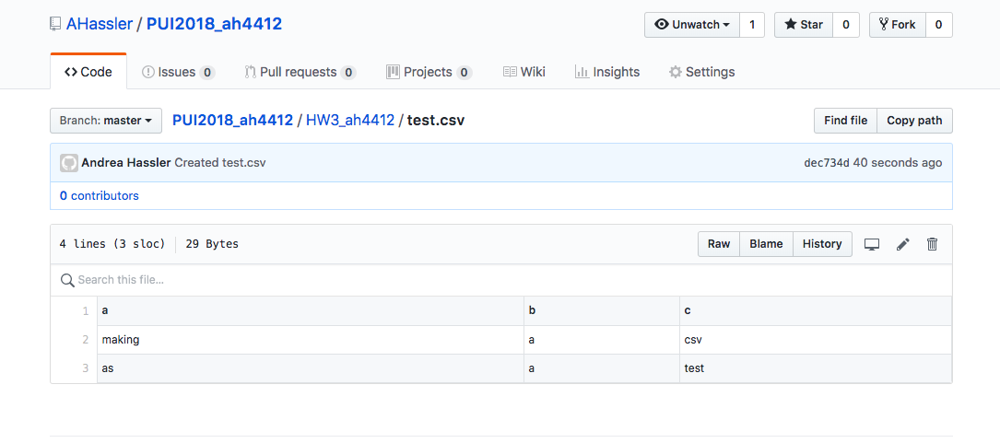
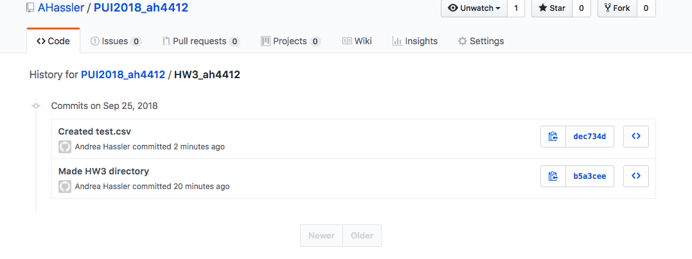
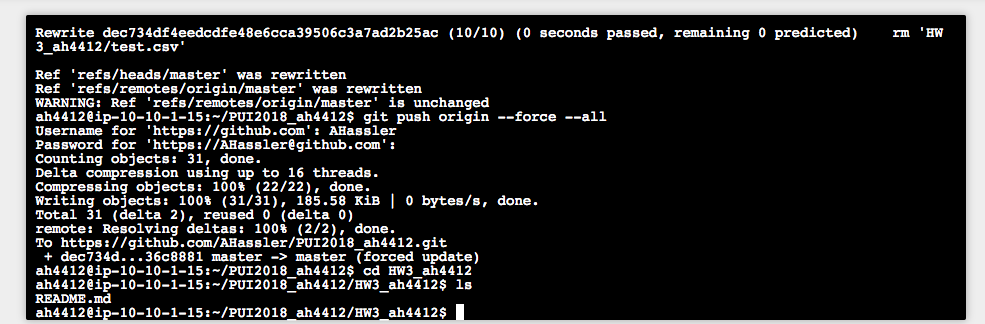
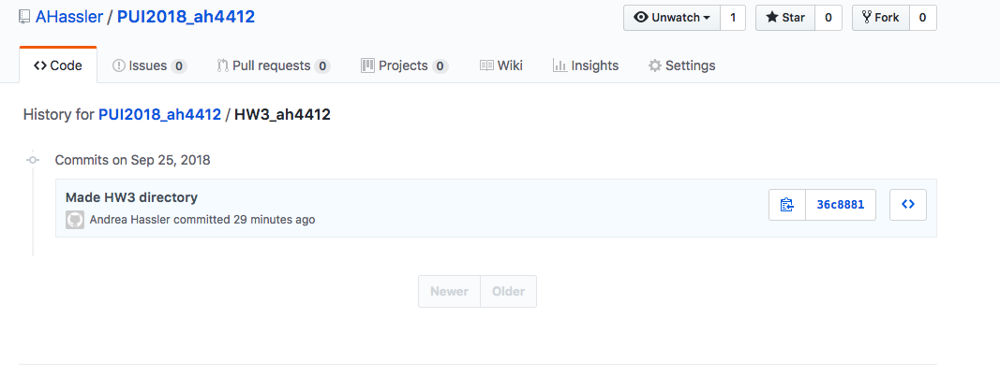

# Summary and Assignment 1 Screenshots
I worked on my own for HW3 (though I hope to collaborate more in the future as I get to know my classmates better). 

For Assignment 1, I created a csv locally and on GitHub, and then I deleted it on both, including its full history. This was practice for needing to fully delete sensitive data that accidentally made its way onto GitHub. 

For Assignment 2, I made a jupyter notebook, in which I downloaded a csv dataset from NYC Open Data, read it into the notebook using pandas, examined it by rendering tables, reducted it to two numeric columns, and finally created a scatterplot from those columns, complete with proper labels and captions.

For Assignment 3, I first obtained an API key from MTA via filling out a form and receiving the key by email. 

## Assignment 1: Deleting the full history of a csv on GitHub

The first screenshot shows the file test.csv on GitHub.

The second shows the history of the repo containing test.csv, including the commit where it was created.

The third shows test.csv has been deleted locally.

The fourth shows test.csv has been deleted on GitHub, along with its history in the repo.

