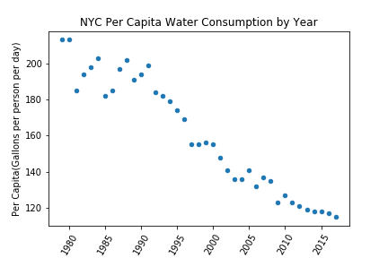

# ah4412_plotReview_yy2908.md

  

**Figure 1:** The plot above shows New York City per capita water consumption by year from 1979 to 2017. Though initially turbulent, the plot shows a general downward trend over time. This may reflect improvements in water efficiency, as well as conscious water conservation efforts.  

First of all,The topic is useful and plot is easy to read. Also has the explain and labels of x and y axis. There is no fault of the polt. 
I noticed that there are Year, New York City Population, NYC Consumption(Million gallons per day), Per Capita(Gallons per person per day)-these four columns. So if you have more time or wanna do a deeper topic, following recommandations are from my perspective, and you could have a try.
1)Compare the change of NYC population with increase rate or decrease rate of per capita. And do some simply analysis.
2)Could we get the data including more factors and information? Like the borough? We could take advantage of borough data and NYC consumption data to make the geodataframe. And use the different color to show the rate of per capita.

To sum up, that is a nice plot. And above recommandation need more time to figure out.
